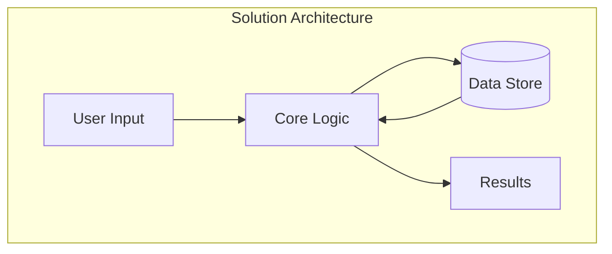

# Brainstorm Session

Deep thinking command for exploring implementation ideas, analyzing possibilities, and capturing creative solutions with context preservation.

## Purpose
- Ultra-deep analysis of implementation ideas
- Interactive requirement gathering
- Possibility and feasibility exploration
- Context preservation for future reference
- Transition to implementation when ready

## Workflow

### Phase 1: Session Initialization
1. **STOP** → "What would you like to brainstorm about?"
   - Wait for user to provide initial concept/idea
   
2. **Generate Session ID**
   ```bash
   # Create unique session identifier
   timestamp=$(date +%Y%m%d_%H%M%S)
   session_id="bs_${timestamp}"
   
   # Extract short description from prompt
   description=$(echo "$prompt" | head -c 30 | tr ' ' '-' | tr -cd '[:alnum:]-')
   filename="brainstorm-${description}"
   ```

3. **Save Initial Prompt**
   ```bash
   mkdir -p .claude/brainstorms
   echo "# Brainstorm: $prompt" > .claude/brainstorms/${filename}.md
   echo "**Session ID**: $session_id" >> .claude/brainstorms/${filename}.md
   echo "**Date**: $(date)" >> .claude/brainstorms/${filename}.md
   echo "**Status**: Active" >> .claude/brainstorms/${filename}.md
   ```

### Phase 2: Ultra-Deep Thinking Mode
1. **Activate Deep Analysis**
   Deploy specialized agents for comprehensive analysis:
   - **backend-architect**: System design implications
   - **frontend-developer**: UI/UX considerations
   - **database-optimizer**: Data structure needs
   - **security-auditor**: Security implications
   - **performance-engineer**: Performance considerations
   - **test-automator**: Testing strategies

2. **Multi-Dimensional Analysis**
   ```
   ULTRA-THINK DIMENSIONS:
   
   1. Technical Feasibility
      - Architecture patterns
      - Technology stack options
      - Integration points
      - Scalability considerations
   
   2. Implementation Complexity
      - Time estimates
      - Resource requirements
      - Skill dependencies
      - Risk factors
   
   3. Business Impact
      - User value
      - Performance implications
      - Maintenance burden
      - Cost-benefit analysis
   
   4. Alternative Approaches
      - Different solutions
      - Trade-offs
      - Hybrid approaches
      - Incremental paths
   ```

### Phase 3: Interactive Exploration

#### Initial Analysis Response
```markdown
## Brainstorm Analysis: [Topic]

### Understanding
Based on your request to [summarize prompt], I'm analyzing:
- Core requirement: [extracted need]
- Key constraints: [identified constraints]
- Success criteria: [inferred goals]

### Initial Thoughts

#### Approach 1: [Name]
**Concept**: [Brief description]
**Pros**: 
- [Advantage 1]
- [Advantage 2]
**Cons**:
- [Challenge 1]
- [Challenge 2]
**Complexity**: Low/Medium/High

#### Approach 2: [Name]
[Similar structure]

### Questions to Explore
1. [Clarification question 1]
2. [Technical constraint question]
3. [User experience question]
4. [Performance requirement question]
5. [Integration question]

### Next Steps
- Would you like to explore any approach in detail?
- Should I analyze specific technical challenges?
- Do you have preferences or constraints to add?
```

#### Iterative Refinement
- STOP → "Your thoughts on this analysis? Any constraints or preferences?"
- Continue gathering context until user is satisfied
- Each iteration adds to the brainstorm document

### Phase 4: Deep Dive Analysis

#### Technical Architecture


#### Implementation Breakdown
```markdown
## Detailed Implementation Plan

### Phase 1: Foundation
1. **Data Model**
   ```typescript
   interface MainEntity {
     id: string;
     // ... properties
   }
   ```

2. **Core Services**
   - Service A: [Purpose]
   - Service B: [Purpose]

3. **Infrastructure**
   - Database: [Type and reason]
   - Cache: [Strategy]
   - Queue: [If needed]

### Phase 2: Core Features
[Detailed breakdown]

### Phase 3: Integration
[Integration points and APIs]
```

#### Risk Analysis
```markdown
## Risk Assessment

### Technical Risks
| Risk | Probability | Impact | Mitigation |
|------|-------------|--------|------------|
| [Risk 1] | High/Med/Low | High/Med/Low | [Strategy] |

### Implementation Risks
- Timeline pressure
- Resource availability
- Technical debt

### Mitigation Strategies
1. [Strategy 1]
2. [Strategy 2]
```

### Phase 5: Possibility Matrix

```markdown
## Implementation Possibilities

### Option A: Full Implementation
**Effort**: 40-60 hours
**Timeline**: 2-3 weeks
**Resources**: 2 developers
**Confidence**: 85%

#### Requirements
- [ ] Database schema design
- [ ] API endpoints (8)
- [ ] Frontend components (5)
- [ ] Test coverage (>80%)
- [ ] Documentation

#### Dependencies
- External API access
- Design approval
- Infrastructure setup

### Option B: MVP Approach
**Effort**: 15-20 hours
**Timeline**: 3-5 days
**Resources**: 1 developer
**Confidence**: 95%

#### Requirements
- [ ] Basic data model
- [ ] Core endpoints (3)
- [ ] Simple UI
- [ ] Basic tests

### Option C: Prototype
**Effort**: 5-8 hours
**Timeline**: 1 day
**Purpose**: Proof of concept
**Confidence**: 100%
```

### Phase 6: Context Capture

#### Save Complete Context
```markdown
# Brainstorm: [Topic]

## Session Information
- **ID**: bs_20240115_143022
- **Date**: 2024-01-15
- **Status**: Complete
- **Decision**: Proceed/Explore/Defer

## Original Concept
[User's initial prompt]

## Exploration Journey

### Iteration 1
**User Input**: [First clarification]
**Analysis**: [Response and insights]

### Iteration 2
[Continued dialogue]

## Final Understanding

### Requirements
1. Functional Requirements
   - [Requirement 1]
   - [Requirement 2]

2. Non-Functional Requirements
   - Performance: [Specs]
   - Security: [Needs]
   - Scalability: [Goals]

### Constraints
- Technical: [List]
- Business: [List]
- Time: [Deadline]

## Solution Design

### Chosen Approach
[Detailed description of selected solution]

### Architecture
[Diagrams and component descriptions]

### Implementation Plan
[Step-by-step plan]

## Technical Specifications

### Data Models
```typescript
// Complete interfaces and schemas
```

### API Design
```yaml
endpoints:
  - POST /api/resource
  - GET /api/resource/:id
```

### Technology Stack
- Backend: [Choice and reason]
- Frontend: [Choice and reason]
- Database: [Choice and reason]

## Risk Mitigation
[Identified risks and strategies]

## Success Criteria
- [ ] [Measurable outcome 1]
- [ ] [Measurable outcome 2]

## Next Actions
1. Create technical specification
2. Set up development environment
3. Begin implementation with /task-init

## References
- [Related documentation]
- [Similar implementations]
- [Technical resources]
```

### Phase 7: Decision Point

1. **STOP** → "Based on this analysis, how would you like to proceed?"
   ```
   1. Implement - Create specification and begin development
   2. Refine - Continue exploring alternatives
   3. Research - Deep dive into specific aspects
   4. Defer - Save for later consideration
   5. Pivot - Explore different approach
   
   Choose action (1-5):
   ```

2. **Based on Decision:**
   
   **If Implement:**
   - Generate full specification document
   - Create task breakdown
   - Prepare for `/task-init`
   - Update status to "Approved"
   
   **If Refine:**
   - Continue brainstorming
   - Explore alternatives
   - Gather more requirements
   
   **If Research:**
   - Deploy specialized agents
   - Research specific technologies
   - Analyze similar solutions
   
   **If Defer:**
   - Save current state
   - Mark as "Deferred"
   - Add revisit date
   
   **If Pivot:**
   - Start new direction
   - Keep history
   - Compare approaches

### Phase 8: Transition to Implementation

If user chooses to implement:

```markdown
## Transition to Implementation

### Generated Artifacts
1. **Specification Document**
   - Saved to: .claude/specs/[topic]-spec.md
   - Ready for /read-specs command

2. **Task List**
   - Created in: todos/todos.md
   - Ready for /task-init

3. **Technical Documentation**
   - Architecture diagrams
   - API specifications
   - Data models

### Recommended Workflow
1. Run `/read-specs .claude/specs/[topic]-spec.md`
2. Run `/task-init` to begin first task
3. Use `/test-suite` for test-driven development
4. Apply `/commit` for version control

### Knowledge Preserved
- All brainstorm context saved
- Decisions documented
- Alternatives recorded
- Can be referenced anytime
```

## Brainstorm Patterns

### Problem-Solution Mapping
```yaml
problem_analysis:
  what: "Core problem statement"
  why: "Root cause analysis"
  who: "Affected users/systems"
  when: "Occurrence patterns"
  where: "System locations"
  how: "Current workarounds"

solution_exploration:
  must_have: "Critical requirements"
  nice_to_have: "Optional features"
  must_not_have: "Explicit exclusions"
  alternatives: "Different approaches"
```

### Complexity Estimation
```javascript
function estimateComplexity(requirements) {
  const factors = {
    dataModels: countEntities(requirements),
    integrations: countExternalSystems(requirements),
    userFlows: countUserStories(requirements),
    businessRules: countBusinessLogic(requirements),
    performance: assessPerformanceNeeds(requirements),
    security: assessSecurityNeeds(requirements)
  };
  
  const complexity = calculateWeightedScore(factors);
  
  return {
    score: complexity,
    level: getComplexityLevel(complexity),
    confidence: getConfidenceLevel(factors),
    risks: identifyRisks(factors)
  };
}
```

## Integration Points

### With `/read-specs`
- Brainstorm outputs can become specifications
- Seamless transition to implementation

### With `/task-init`
- Brainstorm context informs task setup
- Requirements already captured

### With `/write-documentation`
- Brainstorm history becomes design docs
- Decisions are pre-documented

## Configuration

### .claude/brainstorm-config.json
```json
{
  "storage": {
    "path": ".claude/brainstorms",
    "format": "markdown",
    "indexing": true
  },
  "analysis": {
    "depth": "ultra",
    "agents": [
      "backend-architect",
      "frontend-developer",
      "database-optimizer",
      "security-auditor",
      "performance-engineer"
    ],
    "iterations": {
      "min": 2,
      "max": 10
    }
  },
  "templates": {
    "technical": true,
    "business": true,
    "hybrid": true
  },
  "export": {
    "specifications": true,
    "tasks": true,
    "documentation": true
  }
}
```

## Best Practices

1. **Start Broad**
   - Don't constrain initial thinking
   - Explore multiple approaches
   - Question assumptions

2. **Iterate Deeply**
   - Each iteration adds value
   - Build on previous insights
   - Refine understanding

3. **Document Everything**
   - Capture all alternatives
   - Record decision rationale
   - Preserve context

4. **Transition Smoothly**
   - Clear handoff to implementation
   - Maintain context continuity
   - Reference brainstorm in commits

## Notes
- Uses ultra-deep thinking mode
- Preserves complete context
- Interactive requirement gathering
- Seamless implementation transition
- Never loses creative insights