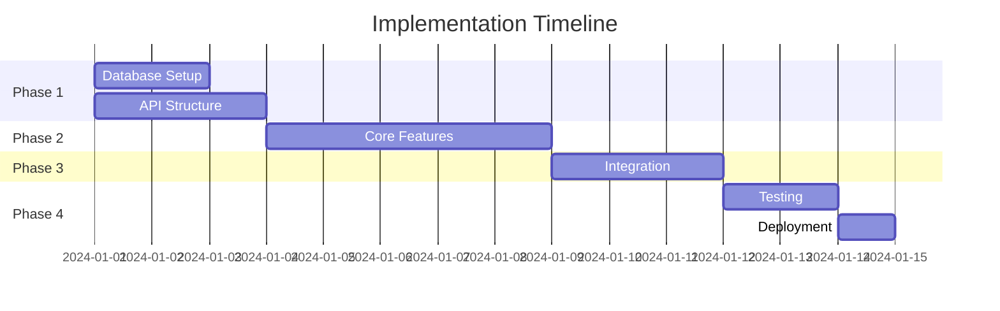

# Specification Reader and Task Decomposer

Intelligent specification analyzer that reads technical documents, decomposes them into actionable tasks, and creates implementation plans with agent assignments and flow diagrams.

## Purpose
- Read and analyze specification documents (.md or .pdf)
- Break down specs into manageable development tasks
- Generate implementation flow diagrams
- Assign specialized agents to each task component
- Create investigation reports or implementation plans

## Workflow

### Phase 1: File Input and Validation
1. **STOP** → "Please provide the path to your specification file (.md or .pdf):"
   - Wait for user to provide file path

2. **Validate File**
   ```bash
   # Check if file exists
   if [ ! -f "$spec_file" ]; then
     echo "File not found: $spec_file"
     exit 1
   fi
   
   # Check file extension
   extension="${spec_file##*.}"
   if [[ "$extension" != "md" && "$extension" != "pdf" ]]; then
     echo "Unsupported file type. Please provide .md or .pdf file"
     exit 1
   fi
   ```

3. **Read File Content**
   - For .md: Direct read with Read tool
   - For .pdf: Read with multimodal support

### Phase 2: Mode Selection
1. **STOP** → "Select operation mode:"
   ```
   1. Investigate - Analyze and understand the specification
      - Deep analysis of requirements
      - Identify challenges and dependencies
      - Assess feasibility and complexity
      - Generate investigation report
   
   2. Plan Implementation - Create actionable development plan
      - Break into development tasks
      - Assign agents to tasks
      - Generate implementation timeline
      - Create task dependencies
   
   Choose mode (1/2 or investigate/plan):
   ```

2. **Mode-Specific Options**
   
   **For Investigate Mode:**
   - STOP → "Focus areas? (all/api/database/security/performance/architecture):"
   - STOP → "Include risk assessment? (y/n):"
   - STOP → "Analyze external dependencies? (y/n):"
   
   **For Plan Implementation Mode:**
   - STOP → "Implementation approach? (incremental/parallel/waterfall):"
   - STOP → "Include test planning? (y/n):"
   - STOP → "Generate agent assignments? (y/n):"
   - STOP → "Create timeline estimates? (y/n):"

### Phase 3: Specification Analysis
1. **Deploy Analysis Agents**
   Use parallel Task agents to analyze different aspects:
   
   **Primary Analysis (All Specs):**
   - **backend-architect**: System requirements and architecture
   - **api-documenter**: API specifications and contracts
   - **database-optimizer**: Data requirements and schema
   - **test-automator**: Testing requirements and scenarios
   
   **Secondary Analysis (As Needed):**
   - **security-auditor**: Security requirements
   - **performance-engineer**: Performance requirements
   - **frontend-developer**: UI/UX specifications
   - **deployment-engineer**: Infrastructure requirements
   - **ui-ux-designer**: Design specifications

2. **Extract Key Components**
   From specification, identify:
   - **Functional Requirements**: What the system must do
   - **Non-Functional Requirements**: Performance, security, etc.
   - **Data Requirements**: Entities, relationships, constraints
   - **Integration Points**: External systems, APIs
   - **User Stories**: User interactions and workflows
   - **Acceptance Criteria**: Success metrics
   - **Constraints**: Technical, business, regulatory

3. **Categorize Complexity**
   ```
   Simple: Single component, <1 day
   Medium: Multiple components, 1-3 days
   Complex: System-wide, 3-5 days
   Epic: Major feature, >5 days
   ```

### Phase 4: Task Decomposition
1. **Break Down Into Tasks**
   
   **Task Structure:**
   ```yaml
   task:
     id: TASK-001
     title: Implement user authentication
     description: Create JWT-based auth system
     type: feature|fix|enhancement|infrastructure
     complexity: simple|medium|complex|epic
     priority: critical|high|medium|low
     dependencies: [TASK-002, TASK-003]
     assigned_agents:
       - backend-architect: Design auth flow
       - security-auditor: Review implementation
       - test-automator: Create test suite
     acceptance_criteria:
       - Users can register
       - Users can login
       - Tokens expire after 24h
     estimated_effort: 2 days
   ```

2. **Create Task Hierarchy**
   ```
   Epic: User Management System
   ├── Feature: Authentication
   │   ├── Task: Implement JWT tokens
   │   ├── Task: Create login endpoint
   │   └── Task: Add password reset
   ├── Feature: Authorization
   │   ├── Task: Implement RBAC
   │   └── Task: Create permission middleware
   └── Feature: User Profile
       ├── Task: CRUD operations
       └── Task: Avatar upload
   ```

3. **Dependency Mapping**
   Identify task dependencies:
   - Technical dependencies (A must complete before B)
   - Resource dependencies (shared components)
   - Data dependencies (schema must exist)
   - External dependencies (third-party services)

### Phase 5: Flow Diagram Generation
1. **Implementation Flow Diagram**
   ```mermaid
   flowchart TB
     Start([Specification Review])
     
     subgraph "Phase 1: Foundation"
       DB[Database Schema]
       API[API Structure]
       AUTH[Authentication]
     end
     
     subgraph "Phase 2: Core Features"
       CRUD[CRUD Operations]
       BL[Business Logic]
       VAL[Validation]
     end
     
     subgraph "Phase 3: Integration"
       EXT[External Services]
       CACHE[Caching Layer]
       QUEUE[Message Queue]
     end
     
     subgraph "Phase 4: Testing"
       UNIT[Unit Tests]
       INT[Integration Tests]
       E2E[E2E Tests]
     end
     
     Start --> DB
     Start --> API
     DB --> AUTH
     API --> AUTH
     AUTH --> CRUD
     CRUD --> BL
     BL --> VAL
     VAL --> EXT
     EXT --> CACHE
     CACHE --> QUEUE
     QUEUE --> UNIT
     UNIT --> INT
     INT --> E2E
     E2E --> End([Deployment Ready])
   ```

2. **Agent Assignment Diagram**
   ```mermaid
   graph LR
     subgraph "Task Distribution"
       T1[Task 1: API Design] --> A1[api-documenter]
       T2[Task 2: Database] --> A2[database-optimizer]
       T3[Task 3: Security] --> A3[security-auditor]
       T4[Task 4: Frontend] --> A4[frontend-developer]
       T5[Task 5: Testing] --> A5[test-automator]
       T6[Task 6: Deploy] --> A6[deployment-engineer]
     end
   ```

3. **Data Flow Diagram**
   ```mermaid
   graph TD
     subgraph "Data Pipeline"
       Input[User Input]
       Validate[Validation Layer]
       Process[Business Logic]
       Store[(Database)]
       Cache[(Cache)]
       Response[API Response]
     end
     
     Input --> Validate
     Validate --> Process
     Process --> Store
     Store --> Cache
     Cache --> Response
     Process --> Response
   ```

4. **Sequence Diagram for Workflows**
   ```mermaid
   sequenceDiagram
     participant User
     participant Frontend
     participant API
     participant Service
     participant Database
     participant External
     
     User->>Frontend: Initiate Action
     Frontend->>API: Send Request
     API->>Service: Process Logic
     Service->>Database: Query Data
     Database-->>Service: Return Data
     Service->>External: Call External API
     External-->>Service: External Response
     Service-->>API: Process Result
     API-->>Frontend: Send Response
     Frontend-->>User: Display Result
   ```

### Phase 6: Output Generation

#### For "Investigate" Mode
Generate investigation report:

```markdown
# Specification Investigation Report

## Executive Summary
[High-level overview of the specification]

## Specification Analysis

### Functional Requirements
[Detailed breakdown of functional requirements]

### Technical Requirements
- **Architecture**: [Required architecture patterns]
- **Technology Stack**: [Required technologies]
- **Integrations**: [External system integrations]
- **Performance**: [Performance requirements]
- **Security**: [Security requirements]

### Complexity Assessment
| Component | Complexity | Rationale |
|-----------|------------|-----------|
| [Component 1] | High | [Reason] |
| [Component 2] | Medium | [Reason] |

### Identified Challenges
1. **Challenge**: [Description]
   - **Impact**: [High/Medium/Low]
   - **Mitigation**: [Proposed solution]

### Dependencies
- **External Services**: [List]
- **Libraries/Frameworks**: [List]
- **Data Sources**: [List]

### Risk Assessment
| Risk | Probability | Impact | Mitigation |
|------|-------------|--------|------------|
| [Risk 1] | High | High | [Strategy] |

### Feasibility Analysis
- **Technical Feasibility**: [Assessment]
- **Resource Requirements**: [Team, time, tools]
- **Timeline Estimate**: [Rough estimate]

### Recommendations
1. [Recommendation 1]
2. [Recommendation 2]

### Questions for Stakeholders
- [Question 1]
- [Question 2]

## Appendix
### Flow Diagrams
[Include generated diagrams]
```

#### For "Plan Implementation" Mode
Generate implementation plan:

```markdown
# Implementation Plan

## Project Overview
**Specification**: [Spec file name]
**Total Tasks**: [N]
**Estimated Duration**: [X days/weeks]
**Required Agents**: [List of specialized agents]

## Implementation Phases

### Phase 1: Foundation ([X] days)
[Foundation tasks and setup]

### Phase 2: Core Development ([X] days)
[Main feature implementation]

### Phase 3: Integration ([X] days)
[Integration and testing]

### Phase 4: Deployment ([X] days)
[Deployment and monitoring]

## Task Breakdown

### Critical Path Tasks
[Tasks that must be completed first]

### Parallel Execution Opportunities
[Tasks that can be done simultaneously]

## Detailed Task List

### TASK-001: [Task Title]
**Type**: Feature/Fix/Enhancement
**Complexity**: Simple/Medium/Complex
**Priority**: Critical/High/Medium/Low
**Assigned Agents**:
- [agent-1]: [Responsibility]
- [agent-2]: [Responsibility]

**Description**:
[Detailed task description]

**Acceptance Criteria**:
- [ ] [Criterion 1]
- [ ] [Criterion 2]

**Dependencies**: [TASK-XXX, TASK-YYY]
**Estimated Effort**: [X hours/days]

**Implementation Steps**:
1. [Step 1]
2. [Step 2]

---

[Repeat for all tasks]

## Agent Assignment Matrix

| Agent | Tasks | Total Effort |
|-------|-------|--------------|
| backend-architect | TASK-001, TASK-003 | 5 days |
| frontend-developer | TASK-002, TASK-004 | 3 days |
| database-optimizer | TASK-005 | 2 days |
| test-automator | TASK-006, TASK-007 | 4 days |

## Implementation Flow
[Include flow diagrams]

## Test Strategy
[Testing approach for the implementation]

## Success Metrics
- [ ] All acceptance criteria met
- [ ] Test coverage > 80%
- [ ] Performance benchmarks achieved
- [ ] Security audit passed

## Timeline


## Risk Mitigation
[Risk mitigation strategies]

## Next Steps
1. Review and approve plan
2. Initialize first phase tasks
3. Set up development environment
4. Begin implementation
```

### Phase 7: Task Integration
1. **Create Task Files**
   ```bash
   # Create tasks directory
   mkdir -p .claude/spec-tasks
   
   # Save decomposed tasks
   for task in tasks; do
     cat > .claude/spec-tasks/TASK-${task_id}.md
   done
   ```

2. **Generate Todo List**
   ```markdown
   # todos/todos.md - Append new tasks
   
   ## From Specification: [spec name]
   - [ ] TASK-001: [Title] (Priority: High, Complexity: Medium)
   - [ ] TASK-002: [Title] (Priority: High, Complexity: Simple)
   - [ ] TASK-003: [Title] (Priority: Medium, Complexity: Complex)
   ```

3. **Integration Options**
   - STOP → "How would you like to proceed?"
   ```
   1. Add all tasks to todos.md
   2. Create separate epic in todos/
   3. Start with critical path tasks only
   4. Export to project management tool
   5. Begin first task immediately with /task-init
   6. Save plan for later
   ```

## Agent Prompting Templates

### Investigation Mode Prompts

**Backend Architect:**
```
Analyze this specification and identify:
1. System architecture requirements
2. Component interactions and dependencies
3. Scalability considerations
4. Technical constraints and challenges
5. Recommended design patterns
6. Integration points with existing systems
```

**Security Auditor:**
```
Review specification for:
1. Security requirements and compliance needs
2. Authentication and authorization requirements
3. Data protection and encryption needs
4. Potential security vulnerabilities
5. Security best practices applicable
6. Threat modeling considerations
```

**Performance Engineer:**
```
Analyze performance requirements:
1. Expected load and scalability needs
2. Response time requirements
3. Resource constraints
4. Caching opportunities
5. Database optimization needs
6. Monitoring and metrics requirements
```

### Implementation Mode Prompts

**Task Decomposition Agent:**
```
Break down this specification into:
1. Discrete, actionable development tasks
2. Task dependencies and relationships
3. Effort estimates for each task
4. Required skills/agents per task
5. Acceptance criteria for each task
6. Optimal execution order
```

**Test Automator:**
```
Based on specification, define:
1. Test scenarios and test cases
2. Unit test requirements
3. Integration test requirements
4. E2E test scenarios
5. Performance test criteria
6. Test data requirements
```

## Specification Parsing Strategies

### Markdown Specifications
1. **Section Extraction**
   - Headers as requirement categories
   - Lists as individual requirements
   - Code blocks as examples
   - Tables as data structures

2. **Requirement Patterns**
   - "Must", "Shall", "Required" → Mandatory
   - "Should", "Recommended" → Important
   - "May", "Optional" → Nice-to-have

### PDF Specifications
1. **Content Extraction**
   - Text extraction with structure preservation
   - Image/diagram extraction
   - Table extraction
   - Bookmark/outline parsing

2. **Visual Analysis**
   - Diagrams and flowcharts
   - Mockups and wireframes
   - Architecture diagrams
   - Data models

## Quality Checks

### Specification Completeness
- [ ] All functional requirements identified
- [ ] Non-functional requirements captured
- [ ] Acceptance criteria defined
- [ ] Edge cases considered
- [ ] Error scenarios documented
- [ ] Performance criteria specified

### Task Quality
- [ ] Tasks are atomic and achievable
- [ ] Clear acceptance criteria
- [ ] Dependencies correctly mapped
- [ ] Effort estimates reasonable
- [ ] Agent assignments appropriate
- [ ] Test requirements included

### Documentation Quality
- [ ] Flow diagrams accurate
- [ ] All requirements traced to tasks
- [ ] Risks identified and mitigated
- [ ] Timeline realistic
- [ ] Resources properly allocated

## Error Handling

### Invalid File
- Check file exists and is readable
- Verify file format (.md or .pdf)
- Handle corrupted files gracefully

### Incomplete Specifications
- Flag missing requirements
- Request clarification points
- Document assumptions made
- Highlight risks from gaps

### Complex Specifications
- Break into multiple phases
- Identify MVP vs full implementation
- Suggest iterative approach
- Highlight critical path

## Integration with Other Commands

### Workflow Connection
```
/read-specs → /task-init → /commit → /mr-draft → /write-documentation
```

### Command Interoperability
- **With /task-init**: Initialize tasks from spec
- **With /write-documentation**: Generate docs from spec
- **With /todo-worktree**: Create worktrees for tasks
- **With /commit**: Track implementation progress

## Output Storage

### Directory Structure
```
.claude/
├── spec-analysis/
│   ├── [timestamp]-investigation.md
│   └── [timestamp]-implementation.md
├── spec-tasks/
│   ├── TASK-001.md
│   ├── TASK-002.md
│   └── task-dependencies.json
└── spec-diagrams/
    ├── flow-diagram.mermaid
    ├── architecture.mermaid
    └── sequence.mermaid
```

## Best Practices

1. **Specification Review**
   - Read entire spec before decomposition
   - Identify ambiguities early
   - Ask clarifying questions
   - Document assumptions

2. **Task Creation**
   - Keep tasks small and focused
   - Define clear boundaries
   - Include test requirements
   - Consider rollback scenarios

3. **Agent Assignment**
   - Match agent expertise to task
   - Consider agent workload
   - Plan for code review
   - Include security review

4. **Documentation**
   - Keep spec analysis with project
   - Update as requirements change
   - Link tasks to spec sections
   - Maintain traceability

## Notes
- Supports both .md and .pdf specifications
- Generates actionable tasks with agent assignments
- Creates visual documentation for implementation
- Integrates with existing task workflow
- Never mentions AI assistance in outputs